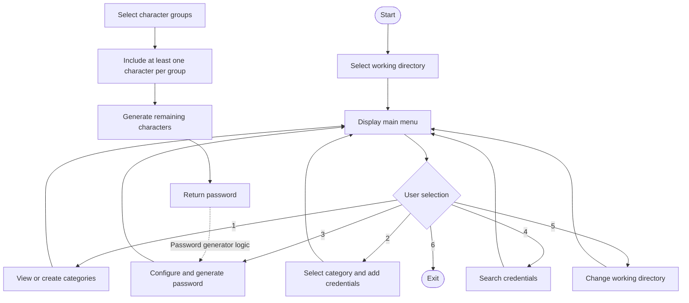

# Password Manager

A command-line password manager built with Python for organizing account credentials in CSV files. The project includes category management, directory navigation, and a password generator under development.

## Features

* **CSV Storage:** Store account information in structured CSV files.
* **Category Management:** Create separate categories to organize credentials.
* **Credential Management:** Add website or application names, usernames, email addresses, and passwords.
* **Password Generation:** Generate random passwords with configurable length and complexity levels.
* **Directory Navigation:** Choose a directory to manage your category files.
* **Command-Line Interface:** Interact with the application through a simple menu.

> **Development status:** Password generation and search are still being developed. Features may change as the project evolves.

## Requirements

* Python 3.10 or higher
* Python standard library
* No external dependencies are required for the current implementation.

## Installation

1. Clone the repository:

   ```bash
   git clone https://github.com/erfan-khoobroo/first-project---Password-Management.git
   ```

2. Navigate to the project directory:

   ```bash
   cd YOUR-REPOSITORY
   ```

3. Run the application:

   ```bash
   python project.py
   ```

   Replace `project.py` with the name of your Python entry-point file if necessary.

## Usage

Start the application and follow the on-screen instructions.

The main menu provides the following options:

1. View existing categories or create a new category.
2. Add account credentials to a category.
3. Generate a password.
4. Search for stored credentials.
5. Change the working directory.
6. Exit the application.

The availability of options may depend on the current development stage.

### Credential fields

Each category is stored in a CSV file with the following columns:

| Field      | Description                 |
| ---------- | --------------------------- |
| `web/app`  | Website or application name |
| `username` | Account username            |
| `email`    | Account email address       |
| `password` | Account password            |

### Password generation

The password generator is designed to support multiple complexity levels and configurable password lengths.

Depending on the selected level, the available character groups may include:

* Digits
* Lowercase letters
* Uppercase letters
* Symbols

The intended design requires at least one character from each enabled group.

## Program Workflow

The following diagram illustrates the main application flow and the intended password-generation process.



## Project Structure

The project is organized around a command-line interface, CSV file handling, and password generation.

```text
password-manager/
├── project.py
├── README.md
└── *.csv
```

* `main.py`: Main program, menu handling, and application logic.
* `README.md`: Project documentation.
* `*.csv`: Category files containing account records.

The structure may be expanded as the project grows.

## Security Notice

**This project is intended for learning and personal development.**

Credentials stored in ordinary CSV files are not encrypted by default. Anyone with access to these files may be able to read the stored information.

Do not use this version to store sensitive, real-world passwords until appropriate security measures—such as encryption and secure key management—have been implemented.

## Future Improvements

* Complete password generation and credential search.
* Add input validation and more robust error handling.
* Improve password security and protect stored credentials.
* Add automated tests.
* Improve the command-line interface.

## License

No license has been specified yet. Add a license file if you intend to publish the project under an open-source license.
